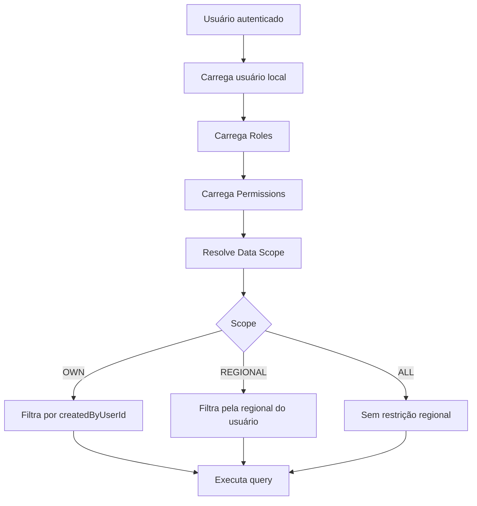

# Especificação histórica: Gestão de Usuários, Perfis, Permissões e Escopo de Dados por Regional

> Status: a maior parte desta especificação foi implementada. Para o contrato e
> a operação atuais, consulte [access-control.md](./access-control.md). Este
> documento é preservado como histórico de requisitos e pode conter etapas já
> concluídas ou alternativas que não representam o comportamento de produção.

A aplicação já utiliza:

- Next.js 15
- React 19
- TypeScript
- NextAuth
- Microsoft Entra ID
- Express
- Prisma
- SQL Server
- monorepo com pnpm

O banco utilizado atualmente contém dados de produção.

A implementação deve respeitar a arquitetura existente, evitar alterações destrutivas e não introduzir frameworks ou tecnologias incompatíveis com o projeto atual.

# Objetivo

Hoje o Microsoft Entra ID autentica os usuários, porém a aplicação ainda não possui controle interno adequado de autorização.

Quero implementar:

```text
Autenticação
Microsoft Entra ID + NextAuth

Autorização
RBAC interno da aplicação

Escopo de dados
Restrição por Regional
```

A aplicação deverá responder separadamente a duas perguntas:

```text
1. O que o usuário pode fazer?
   → Permission

2. Quais dados o usuário pode acessar?
   → Data Scope / Regional
```

Regra fundamental desta implementação:

```text
ADMIN
→ pode visualizar todas as regionais

MANAGER
→ pode visualizar somente sua própria regional

USER
→ pode visualizar somente seus próprios registros

VIEWER
→ inicialmente deve respeitar sua regional, salvo regra explícita diferente
```

Não implementar acesso global para MANAGER.

# Arquitetura atual

```text
Usuário
   ↓
Microsoft Entra ID
   ↓
NextAuth
   ↓
Next.js
   ↓
Route Handlers /api
   ↓
Express
   ↓
Prisma
   ↓
SQL Server
```

Estrutura:

```text
frontend/
  src/app/
  src/components/
  src/hooks/
  src/lib/
  middleware.ts

backend/
  src/controllers/
  src/services/
  src/repositories/
  src/routes/
  src/validators/
  prisma/schema.prisma

docs/
e2e/
load-tests/
```

Não adicionar:

```text
NestJS
outro ORM
outro sistema de autenticação
Redis
nova infraestrutura sem necessidade
```

# Antes de implementar

Analise o projeto real antes de escrever código.

Localize:

```text
frontend/src/lib/
frontend/src/app/api/
frontend/middleware.ts

backend/src/routes/
backend/src/controllers/
backend/src/services/
backend/src/repositories/
backend/src/validators/

backend/prisma/schema.prisma
```

Identifique:

- configuração atual do NextAuth;
- Microsoft Entra provider;
- callbacks `jwt` e `session`;
- claims disponíveis;
- como o BFF Next.js chama o Express;
- como a identidade do usuário chega ao backend;
- modelo atual `SalesIntention`;
- campos atuais relacionados a regional;
- modelo/tabela de catálogo onde as regionais são obtidas;
- repositories e services existentes;
- tratamento de erros;
- testes existentes;
- migrations Prisma atuais.

Antes de alterar código, apresentar resumidamente:

```text
Arquitetura encontrada
Fluxo atual de autenticação
Como a regional aparece atualmente no SalesIntention
Como a regional é representada no banco
Arquivos a alterar
Arquivos a criar
Migrations necessárias
Riscos para produção
```

Depois continuar e implementar a feature.

Não parar apenas na análise.

# Segurança de produção

IMPORTANTE:

O SQL Server contém dados reais de produção.

Não executar automaticamente:

```bash
prisma migrate reset
prisma db push
prisma migrate dev
```

contra produção.

Não:

- apagar tabelas;
- recriar banco;
- limpar dados;
- alterar campos existentes de forma destrutiva;
- tornar coluna existente obrigatória sem plano de migração;
- tentar inferir dados históricos sem evidência confiável.

Gerar migrations para revisão.

Toda mudança deve ser backward-compatible sempre que possível.

# Identidade do usuário

Não utilizar email como identificador permanente.

Utilizar:

```text
oid
tid
```

Onde:

```text
oid = Entra Object ID
tid = Tenant ID
```

Identidade única:

```text
tenantId + entraObjectId
```

Criar constraint correspondente.

# Modelagem

Implementar:

```text
User
Role
Permission
UserRole
RolePermission
```

E incluir no usuário a informação necessária para determinar sua regional.

A primeira versão pode armazenar a regional diretamente no usuário caso exista uma Regional única por usuário.

Modelo conceitual:

```text
User
 ├── roles
 └── regional
```

Evite duplicar texto livre de regional se o projeto já possuir entidade/tabela/catálogo com identificador confiável.

Primeiro analise como Regional é representada atualmente.

Se já existir identificador/chave normalizada de regional, utilizar essa chave.

Não relacionar registros apenas pelo nome visual caso exista ID/chave estável.

# User

Criar/adaptar modelo:

```prisma
model User {
  id             Int       @id @default(autoincrement())
  entraObjectId  String
  tenantId       String
  name           String
  email          String?
  department     String?
  jobTitle       String?
  regional       String?
  active         Boolean   @default(true)
  lastLoginAt    DateTime?
  createdAt      DateTime  @default(now())
  updatedAt      DateTime  @updatedAt

  roles UserRole[]

  @@unique([tenantId, entraObjectId])
}
```

Esse exemplo é conceitual.

Se houver entidade/chave de regional melhor no projeto, preferir:

```text
regionalId
```

ou:

```text
regionalCode
```

em vez de texto livre.

# Regional

A regional será uma propriedade administrativa da aplicação.

Não assumir automaticamente que `department` do Entra representa a regional.

Regional deve ser controlada internamente.

Exemplo:

```text
Usuário: João Silva
Role: MANAGER
Regional: SUL
```

O Microsoft Entra poderá continuar sincronizando:

```text
name
email
department
jobTitle
```

Mas não deve sobrescrever automaticamente:

```text
roles
regional
active
permissions
```

# Roles iniciais

Criar:

```text
USER
MANAGER
VIEWER
ADMIN
```

# Permissions

Criar:

```text
INTENTION_CREATE
INTENTION_VIEW
INTENTION_UPDATE
INTENTION_DELETE

REPORT_VIEW
REPORT_EXPORT

USER_VIEW
USER_MANAGE

ROLE_VIEW
ROLE_MANAGE
```

# Data Scope

Além das permissions, implementar conceito explícito de escopo de dados.

Criar constantes/tipos:

```typescript
export const DATA_SCOPES = {
  OWN: 'OWN',
  REGIONAL: 'REGIONAL',
  ALL: 'ALL',
} as const;
```

Evitar espalhar strings pelo código.

Mapeamento inicial:

```text
USER
→ OWN

MANAGER
→ REGIONAL

VIEWER
→ REGIONAL

ADMIN
→ ALL
```

Importante:

Não confundir permission com scope.

Exemplo:

```text
MANAGER possui:
REPORT_VIEW

Scope:
REGIONAL
```

Isso significa:

```text
Pode abrir relatório?
SIM

Pode consultar qualquer regional?
NÃO

Consulta somente:
sua regional
```

# Regra para MANAGER

Esta é uma regra obrigatória:

```text
MANAGER só pode consultar registros pertencentes à sua regional.
```

Exemplo:

```text
Usuário:
Maria

Role:
MANAGER

Regional:
SUDESTE
```

Maria pode consultar:

```text
SalesIntention.regional = SUDESTE
```

Maria não pode consultar:

```text
SUL
NORDESTE
NORTE
CENTRO-OESTE
```

Essa regra deve ser aplicada no backend.

Nunca confiar apenas em filtro enviado pelo frontend.

# Não confiar em query params

Exemplo de ataque:

```text
MANAGER da regional SUL
```

faz manualmente:

```http
GET /sales-intentions?regional=SUDESTE
```

O backend deve ignorar ou rejeitar esse filtro fora do escopo permitido.

A regra final deve vir do usuário autenticado.

Exemplo conceitual:

```typescript
if (scope === 'REGIONAL') {
  query.where.regional = authenticatedUser.regional;
}
```

Mesmo que o frontend envie outra regional.

# SalesIntention

Analise o modelo atual para descobrir exatamente qual campo representa Regional.

Não criar um segundo campo de regional se já existir um campo confiável.

Exemplo conceitual:

```text
SalesIntention.regional
```

Todos os endpoints de leitura devem respeitar o escopo.

# USER e ownership

O perfil USER deve visualizar apenas seus próprios registros.

Portanto preparar/implementar associação entre SalesIntention e usuário criador.

Adicionar de forma segura:

```text
createdByUserId
```

na `SalesIntention`.

Como o banco está em produção, inicialmente:

```text
createdByUserId = nullable
```

Não preencher registros históricos automaticamente sem informação confiável.

Novas intenções devem obrigatoriamente registrar o usuário autenticado como criador.

Exemplo:

```typescript
createdByUserId = authenticatedUser.id
```

O frontend não deve enviar esse campo como fonte confiável.

O backend deve defini-lo usando a identidade autenticada.

# Regras de escopo

Criar lógica centralizada.

Exemplo:

```typescript
switch (scope) {
  case 'OWN':
    where.createdByUserId = user.id;
    break;

  case 'REGIONAL':
    where.regional = user.regional;
    break;

  case 'ALL':
    break;
}
```

Não copiar essa lógica manualmente em dezenas de controllers.

Criar serviço reutilizável.

Exemplo:

```text
DataScopeService
```

ou:

```text
AuthorizationScopeService
```

Responsabilidades:

```typescript
getDataScope(user)

applySalesIntentionScope(user, filters)

canAccessSalesIntention(user, salesIntention)
```

# Consulta de listagem

Para:

```text
GET /sales-intentions
GET /sales-intentions/search
```

aplicar automaticamente:

```text
USER
WHERE createdByUserId = currentUser.id

MANAGER
WHERE regional = currentUser.regional

VIEWER
WHERE regional = currentUser.regional

ADMIN
sem restrição adicional
```

# Consulta por ID

Essa proteção é obrigatória.

Não basta proteger listagens.

Exemplo:

```http
GET /sales-intentions/123
```

Antes de retornar o registro:

```text
1. buscar registro;
2. verificar permission;
3. verificar data scope;
4. retornar ou bloquear.
```

Exemplo:

```text
MANAGER SUL
```

tenta abrir uma intenção:

```text
regional = SUDESTE
```

Resultado:

```text
403
```

ou `404` caso o projeto opte deliberadamente por não revelar existência de recursos fora do escopo.

Escolher um comportamento consistente e documentar.

# Atualização

Aplicar mesma regra em:

```text
PUT /sales-intentions/:id
```

O usuário precisa possuir:

```text
INTENTION_UPDATE
```

e também ter acesso ao registro pelo Data Scope.

Exemplo:

```text
MANAGER SUL
```

não pode editar registro:

```text
regional SUDESTE
```

mesmo possuindo `INTENTION_UPDATE`.

# Exclusão

Para:

```text
DELETE /sales-intentions/:id
```

validar:

```text
INTENTION_DELETE
+
data scope
```

# Criação de intenção

Para:

```text
POST /sales-intentions
```

definir:

```text
createdByUserId = authenticatedUser.id
```

no backend.

Nunca aceitar um `createdByUserId` arbitrário do frontend.

Caso a intenção tenha Regional:

Para USER ou MANAGER, avaliar se a Regional enviada corresponde ao escopo do usuário.

Para MANAGER:

```text
regional da nova intenção
deve ser igual à regional do gestor
```

Não permitir que MANAGER crie registro em outra regional.

Se a regra de negócio atual permitir USER criar intenção vinculada à sua regional, aplicar a mesma proteção.

# Relatórios

Rotas de relatório devem exigir:

```text
REPORT_VIEW
```

e Data Scope.

Exemplo:

```text
MANAGER regional SUDESTE

Relatório:
somente dados SUDESTE
```

Nenhuma agregação pode considerar registros de outras regionais.

Isso é especialmente importante para:

```text
quantidades
totais
percentuais
rankings
gráficos
comparativos
KPIs
```

A restrição precisa acontecer antes da agregação.

Não calcular todos os dados e apenas esconder itens no frontend.

# Dashboard

Aplicar o mesmo Data Scope ao Dashboard.

Exemplo:

```text
ADMIN
Dashboard nacional

MANAGER
Dashboard da própria regional

VIEWER
Dashboard da própria regional
```

Os cards, gráficos e totais devem ser calculados sobre o conjunto já filtrado pelo escopo.

# Relatório por vendedor

Para MANAGER:

```text
/relatorios/vendedor
```

deve mostrar somente vendedores/registros pertencentes à Regional do gestor.

Não permitir filtrar vendedores de outra regional.

# Relatório por marca

Mesmo que o relatório seja agrupado por marca:

```text
Marca A = 100
Marca B = 80
```

para MANAGER os valores devem representar somente sua Regional.

# Filtros do frontend

Para MANAGER, os filtros também devem refletir o escopo.

Exemplo:

se existe dropdown:

```text
Regional
```

MANAGER não deve poder selecionar outra regional.

Opções:

```text
1. esconder filtro Regional
ou
2. exibir sua regional bloqueada/read-only
```

Escolher a opção que melhor se encaixar na UX existente.

ADMIN poderá visualizar todas as regionais.

# Perfil do usuário

Na página:

```text
/perfil
```

mostrar:

```text
Nome
E-mail
Departamento
Cargo
Perfil
Regional
```

Se a Regional for administrativa, deixar readonly para o próprio usuário.

# Administração de usuários

Criar:

```text
/configuracoes/usuarios
```

ou rota equivalente coerente com o projeto.

Tabela:

```text
Nome
E-mail
Departamento
Cargo
Perfil
Regional
Status
Último acesso
Ações
```

Filtros:

```text
Nome
E-mail
Perfil
Regional
Status
```

# Gestão de Regional

Quem possuir:

```text
USER_MANAGE
```

poderá atribuir a Regional do usuário.

Exemplo:

```text
Nome:
João Silva

Perfil:
MANAGER

Regional:
SUDESTE
```

Para MANAGER ou VIEWER, Regional deve ser obrigatória.

Validar:

```text
MANAGER sem regional
→ não permitir salvar
```

ou bloquear acesso até configuração.

Preferir impedir configuração inconsistente.

# ADMIN

ADMIN pode:

```text
visualizar todas as regionais
consultar todos os registros
visualizar relatórios nacionais
```

Não precisa possuir Regional.

Seu scope é:

```text
ALL
```

# USER

USER possui:

```text
scope = OWN
```

Portanto:

```text
SalesIntention.createdByUserId = User.id
```

Não utilizar e-mail ou nome do vendedor como critério de ownership.

# VIEWER

Nesta primeira implementação:

```text
VIEWER
→ REPORT_VIEW
→ INTENTION_VIEW
→ scope REGIONAL
```

VIEWER deve possuir Regional configurada.

# Permission + Scope

O mecanismo deve considerar ambos.

Exemplo:

```typescript
canAccess =
  hasPermission(user, 'INTENTION_VIEW')
  &&
  isWithinScope(user, intention);
```

Permission sozinha não concede acesso global.

# Backend

Criar componentes equivalentes a:

```text
Authentication middleware
Authorization middleware
AuthorizationService
DataScopeService
UserRepository
RoleRepository
PermissionRepository
```

Seguir arquitetura atual.

Não colocar lógica complexa no controller.

# Express

Exemplo conceitual:

```typescript
router.get(
  '/sales-intentions',
  authenticate,
  requirePermission('INTENTION_VIEW'),
  controller.list
);
```

No service/repository:

```typescript
const scopedFilters =
  dataScopeService.applySalesIntentionScope(
    authenticatedUser,
    filters
  );
```

# Authorization Context

Criar estrutura:

```typescript
{
  id: number;
  entraObjectId: string;
  tenantId: string;

  name: string;
  email?: string;

  regional?: string;

  roles: string[];
  permissions: string[];

  dataScope: 'OWN' | 'REGIONAL' | 'ALL';
}
```

# Sincronização do Entra

No primeiro login:

```text
Entra
 ↓
buscar tenantId + entraObjectId
 ↓
não existe
 ↓
criar User
 ↓
atribuir USER
```

Não atribuir regional automaticamente usando valores não confiáveis do Entra.

Regional deverá ser configurada administrativamente, salvo se já existir uma regra corporativa confiável no projeto.

# Usuário sem regional

Para MANAGER/VIEWER:

se Regional for obrigatória e estiver ausente:

```text
não permitir acesso às funcionalidades que dependam de escopo regional
```

Retornar erro de domínio claro.

Exemplo:

```text
Usuário sem regional configurada.
Entre em contato com o administrador.
```

Não interpretar regional ausente como:

```text
ALL
```

Isso seria uma falha de segurança.

# APIs administrativas

Criar:

```text
GET /users
GET /users/:id
PATCH /users/:id/status
PUT /users/:id/roles
PUT /users/:id/regional
```

Permissões:

```text
GET
USER_VIEW

alterações
USER_MANAGE
```

Pode também agrupar alterações administrativas em endpoint coerente com o padrão existente.

# Lista de usuários

Permitir filtros:

```text
search
role
regional
active
page
pageSize
```

# Roles

Criar:

```text
GET /roles
GET /roles/:id
POST /roles
PATCH /roles/:id
PUT /roles/:id/permissions
```

Permissões:

```text
ROLE_VIEW
ROLE_MANAGE
```

# Seed

Criar seed idempotente.

Roles:

```text
USER
MANAGER
VIEWER
ADMIN
```

Permissions:

```text
INTENTION_CREATE
INTENTION_VIEW
INTENTION_UPDATE
INTENTION_DELETE
REPORT_VIEW
REPORT_EXPORT
USER_VIEW
USER_MANAGE
ROLE_VIEW
ROLE_MANAGE
```

Associação inicial:

USER:

```text
INTENTION_CREATE
INTENTION_VIEW
INTENTION_UPDATE
```

MANAGER:

```text
INTENTION_CREATE
INTENTION_VIEW
INTENTION_UPDATE
REPORT_VIEW
REPORT_EXPORT
```

VIEWER:

```text
INTENTION_VIEW
REPORT_VIEW
```

ADMIN:

```text
todas
```

Data Scope:

```text
USER = OWN
MANAGER = REGIONAL
VIEWER = REGIONAL
ADMIN = ALL
```

# Como armazenar Data Scope

Antes de escolher onde persistir o escopo, analisar se ele deve ser:

```text
propriedade do Role
```

ou derivado de regra de negócio.

Para esta versão, como existe relação clara:

```text
USER → OWN
MANAGER → REGIONAL
VIEWER → REGIONAL
ADMIN → ALL
```

é aceitável armazenar `dataScope` em `Role`.

Exemplo:

```prisma
model Role {
  id          Int
  code        String
  name        String
  dataScope   String
  ...
}
```

Preferencialmente usar enum Prisma caso seja seguro e compatível com SQL Server e com o padrão existente.

Não complicar com uma tabela de scope independente nesta primeira versão.

# Múltiplos roles

Como User pode possuir vários roles, definir claramente a precedência de scope.

Não simplesmente escolher o scope mais permissivo sem análise.

Para esta aplicação, implementar regra explícita e documentada.

Sugestão:

```text
ADMIN presente
→ ALL

senão MANAGER ou VIEWER
→ REGIONAL

senão
→ OWN
```

Não permitir que combinação acidental de roles eleve privilégios sem regra explícita.

Documentar essa decisão.

# Segurança crítica

Não confiar em:

```text
userId
regional
roles
permissions
dataScope
```

enviados pelo browser.

Toda informação de autorização deve ser obtida no backend usando a identidade autenticada.

O browser pode utilizar roles/permissions apenas para UX.

A segurança real deve estar no Express/service/repository.

# Next.js BFF

Analisar como o proxy:

```text
frontend/src/app/api
```

transmite a identidade ao Express.

Garantir que o Express consiga confiar na identidade recebida.

Não permitir spoofing por headers arbitrários enviados diretamente pelo usuário.

Documentar a estratégia.

# Testes obrigatórios

Criar testes para:

## MANAGER acessando sua regional

```text
MANAGER
regional = SUL

registro regional = SUL

→ permitido
```

## MANAGER acessando outra regional

```text
MANAGER
regional = SUL

registro regional = SUDESTE

→ negado
```

## Manipulação de query param

```text
MANAGER SUL

GET /sales-intentions?regional=SUDESTE

→ não retornar dados SUDESTE
```

## Acesso por ID

```text
MANAGER SUL

GET /sales-intentions/{registroSudeste}

→ acesso negado
```

## Atualização fora da regional

```text
MANAGER SUL

PUT registro SUDESTE

→ 403
```

## Exclusão fora da regional

```text
MANAGER SUL

DELETE registro SUDESTE

→ 403
```

## Dashboard

```text
MANAGER SUL

→ métricas calculadas somente com registros SUL
```

## Relatórios

```text
MANAGER SUL

→ relatórios somente SUL
```

## USER

```text
USER A
→ vê registros criados por A

USER A
→ não vê registros criados por B
```

## ADMIN

```text
ADMIN
→ acessa qualquer regional
```

## Usuário sem regional

```text
MANAGER sem regional
→ acesso regional bloqueado
```

# Testes E2E

Adicionar Playwright para:

```text
ADMIN vê todas as regionais

MANAGER vê somente sua regional

MANAGER não consegue alterar filtro para outra regional

VIEWER vê somente sua regional

USER vê somente suas intenções
```

Não confiar apenas em teste de UI.

Criar também testes backend.

# Performance

Aplicar Data Scope diretamente nas queries SQL/Prisma.

Preferir:

```typescript
prisma.salesIntention.findMany({
  where: {
    regional: user.regional
  }
})
```

em vez de:

```text
buscar tudo
→ filtrar em memória
```

Isso é crítico para:

- segurança;
- performance;
- relatórios;
- dashboards.

# Índices

Analise índices existentes de `SalesIntention`.

Como Regional passará a ser critério frequente de filtro, avaliar índice em:

```text
regional
```

e eventualmente índices compostos com:

```text
regional + dataSolicitacao
```

porque o Dashboard utiliza `dataSolicitacao` como principal eixo temporal.

Não criar índice cegamente.

Primeiro analisar índices atuais e queries.

Documentar recomendação e impacto.

# Migration de SalesIntention

Caso `createdByUserId` ainda não exista:

adicionar como nullable.

Exemplo conceitual:

```text
createdByUserId INT NULL
```

Adicionar FK para User.

Não exigir valor nos registros antigos.

Novas intenções devem possuir usuário criador.

# Registros históricos

Não atribuir registros históricos a usuários utilizando:

```text
email parecido
nome parecido
nome do vendedor
```

sem garantia de identidade.

Preservar como `NULL`.

Definir comportamento histórico.

Para MANAGER:

registros históricos continuam podendo ser acessados pela Regional.

Para USER:

registros sem `createdByUserId` não devem ser automaticamente considerados seus.

Documentar.

# Documentação

Criar:

```text
docs/access-control.md
```

Explicar:

```text
Autenticação
RBAC
Roles
Permissions
Regional
Data Scope
OWN
REGIONAL
ALL
```

Adicionar tabela:

| Role | Scope | Comportamento |
|---|---|---|
| USER | OWN | Somente registros próprios |
| MANAGER | REGIONAL | Somente sua regional |
| VIEWER | REGIONAL | Somente sua regional |
| ADMIN | ALL | Todas as regionais |

Documentar como uma consulta é protegida.

Exemplo:

```text
Permission
+
Data Scope
+
Resource
=
Access Decision
```

# Fluxo esperado



# Critérios de aceite

A feature só estará concluída quando:

- usuário for identificado por `oid + tid`;
- usuários existirem no banco local;
- roles existirem no banco;
- permissions existirem no banco;
- regional estiver associada ao usuário;
- MANAGER exigir regional;
- VIEWER exigir regional;
- USER utilizar OWN;
- MANAGER utilizar REGIONAL;
- VIEWER utilizar REGIONAL;
- ADMIN utilizar ALL;
- `SalesIntention` registrar `createdByUserId` em novos registros;
- usuário comum não enxergar registros de outro usuário;
- gestor não enxergar registros de outra regional;
- gestor não acessar registro de outra regional diretamente por ID;
- gestor não editar registro de outra regional;
- gestor não excluir registro de outra regional;
- filtros manipulados pelo frontend não burlarem o scope;
- dashboards respeitarem regional;
- relatórios respeitarem regional;
- agregações respeitarem regional;
- backend validar permissions;
- backend validar scope;
- frontend refletir essas permissões na UX;
- migrations serem seguras;
- testes serem criados;
- OpenAPI ser atualizado;
- documentação ser criada.

# Ordem de implementação

Implementar nesta ordem:

```text
1. Analisar autenticação atual
2. Analisar campo de Regional existente
3. Analisar SalesIntention
4. Criar modelos RBAC
5. Criar regional no User
6. Criar dataScope no Role
7. Criar migration segura
8. Criar seed
9. Criar UserRepository
10. Criar AuthorizationService
11. Criar DataScopeService
12. Implementar sincronização Entra
13. Implementar createdByUserId
14. Proteger listagens
15. Proteger busca por ID
16. Proteger update/delete
17. Aplicar scope aos dashboards
18. Aplicar scope aos relatórios
19. Integrar sessão NextAuth
20. Implementar usePermissions
21. Adaptar menus e filtros
22. Criar gestão de usuários
23. Criar gestão de Regional
24. Criar testes
25. Atualizar OpenAPI
26. Criar documentação
```

# Validação final

Após implementação executar:

```bash
pnpm lint
pnpm typecheck
pnpm test:unit
```

Executar:

```bash
pnpm test:e2e
```

se o ambiente suportar.

Não executar automaticamente:

```bash
pnpm test:load:60
```

Não executar migration contra produção sem autorização explícita.

Ao finalizar, apresentar:

```text
Resumo da implementação
Arquivos criados
Arquivos alterados
Mudanças no Prisma
Migration gerada
Novos endpoints
Regras de Regional
Regras de Data Scope
Testes realizados
Resultados
Riscos e pendências
```
