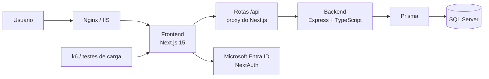
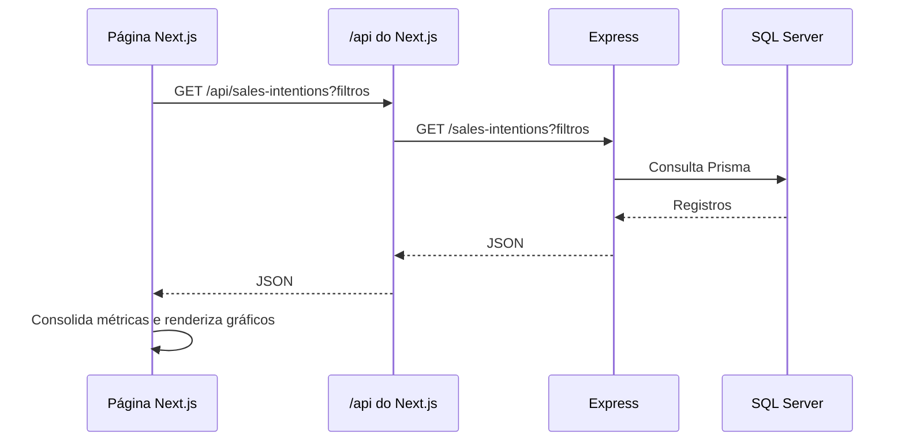

# Mapa do projeto

## Visão geral

O CAOA Venda Cantada Dash é um monorepo `pnpm` com uma aplicação web em Next.js e
uma API em Express. A web apresenta dashboard, relatórios e cadastro de intenções;
a API lê e grava os dados no SQL Server por meio do Prisma.



## Estrutura do repositório

```text
.
├── frontend/                 # Interface Next.js
│   ├── src/app/              # Páginas, layouts e rotas de API
│   ├── src/components/       # Componentes de UI, gráficos e navegação
│   ├── src/hooks/            # Hooks de busca e interação
│   ├── src/lib/              # Cliente de API, autenticação e utilitários
│   ├── middleware.ts         # Proteção das rotas autenticadas
│   └── server.mjs            # Servidor Next.js em produção
├── backend/                  # API Express
│   ├── src/controllers/      # Camada HTTP
│   ├── src/services/         # Regras de negócio
│   ├── src/repositories/     # Acesso a dados pelo Prisma
│   ├── src/routes/           # Endpoints da API
│   ├── src/validators/       # Validação de query strings e entradas
│   └── prisma/schema.prisma  # Modelos e índices do banco
├── docs/                     # Documentação técnica e operacional
├── deploy/                   # Nginx, IIS e certificados de produção
├── load-tests/               # Testes de carga em k6
├── e2e/                      # Testes Playwright
├── scripts/                  # Scripts de inicialização e operação
├── docker-compose.yml        # Ambiente local com SQL Server
├── docker-compose.prod.yml   # Topologia de produção com Nginx
└── package.json              # Comandos do monorepo
```

## Camadas e responsabilidades

| Camada | Tecnologia | Responsabilidade |
| --- | --- | --- |
| Interface | Next.js 15, React 19, Tailwind, VisActor | Exibe dashboard, relatórios, cadastro, filtros e gráficos. |
| Autenticação | NextAuth + Microsoft Entra ID | Cria a sessão do usuário e protege as páginas internas. |
| BFF/proxy | Route Handlers do Next.js em `frontend/src/app/api` | Encaminha as chamadas da interface para o backend e aplica timeout. |
| API | Express + TypeScript | Expõe intenções de venda, catálogos, modelos e classificações. |
| Dados | Prisma + SQL Server | Persiste as intenções e as fontes de opções de filtros. |
| Entrega | Docker, Nginx, IIS ou PM2 | Executa os serviços em desenvolvimento e produção. |

## Fluxo de dados



O cliente de dados fica em `frontend/src/lib/salesIntentionApi.ts`. As telas usam o
hook `frontend/src/hooks/useSalesIntentions.ts` ou consultas específicas para
relatórios, catálogos e detalhes de bandeira.

## Rotas da interface

| Rota | Finalidade | Protegida |
| --- | --- | --- |
| `/` | Entrada da aplicação | Não |
| `/login` | Autenticação Microsoft | Não |
| `/dashboard` | Painel de vendas cantadas | Sim |
| `/dashboard/bandeiras/[bandeira]` | Detalhe e análise de uma bandeira | Sim |
| `/relatorios/marca` | Relatório por marca de veículo | Sim |
| `/relatorios/vendedor` | Relatório e comparativo de vendedores | Sim |
| `/sales-intention` | Cadastro e gestão de intenção de venda | Sim |
| `/perfil` | Dados do perfil do usuário | Sim |
| `/test-relatorios` | Tela pública de apoio a testes | Não |

`frontend/middleware.ts` protege os grupos `dashboard`, `relatorios`,
`sales-intention` e `configuracoes`. Os layouts dessas áreas também verificam a
sessão do servidor antes de renderizar a página.

## Rotas de dados

As rotas abaixo existem em dois níveis: a web oferece `/api/...` e faz proxy para o
backend, que recebe a rota sem o prefixo `/api`.

| Web | Backend | Uso principal |
| --- | --- | --- |
| `GET /api/sales-intentions` | `GET /sales-intentions` | Lista por período e tipo de venda. |
| `GET /api/sales-intentions/search` | `GET /sales-intentions/search` | Busca com filtros avançados. |
| `GET /api/sales-intentions/:id` | `GET /sales-intentions/:id` | Detalhe de um registro. |
| `POST /api/sales-intentions` | `POST /sales-intentions` | Cria uma intenção. |
| `PUT /api/sales-intentions/:id` | `PUT /sales-intentions/:id` | Atualiza uma intenção. |
| `DELETE /api/sales-intentions/:id` | `DELETE /sales-intentions/:id` | Remove uma intenção. |
| `GET /api/sales-intention-catalogs` | `GET /sales-intention-catalogs` | Opções de filtros e formulário. |
| `GET /api/sales-intention-modelos-dealer` | `GET /sales-intention-modelos-dealer` | Combinações de veículo e consulta por placa. |
| `GET /api/sales-intention-classificacoes` | `GET /sales-intention-classificacoes` | Classificações de venda. |

O backend também expõe `GET /health`, `GET /docs` e `GET /openapi.json` para saúde e
documentação da API.

## Modelo de dados

| Modelo Prisma | Papel | Índices relevantes |
| --- | --- | --- |
| `SalesIntention` | Registro principal de uma intenção de venda. | `dataSolicitacao` |
| `SalesIntentionCatalog` | Fonte das opções de filtro e formulário. | tipo, bandeira, regional e marca |
| `SalesIntentionOptionCombination` | Combinações normalizadas de opções. | chave única e tipo/bandeira/regional |

O schema está em `backend/prisma/schema.prisma`. A data de solicitação é o principal
eixo temporal dos dashboards e relatórios.

## Operação e ambientes

| Contexto | Componentes e portas |
| --- | --- |
| Desenvolvimento direto | Frontend em `:3000` e backend em `:4000`. |
| Docker local | Frontend em `:3001`, backend em `:4001` e SQL Server em `:1433`. |
| Produção Docker | Nginx em `:80/:443`, frontend interno em `:3003` e backend interno em `:4000`. |
| Produção nativa | IIS como proxy HTTPS ou PM2 usando `ecosystem.config.cjs`. |

Arquivos de referência: `docker-compose.yml`, `docker-compose.prod.yml`,
`deploy/nginx.conf`, `frontend/web.config` e `ecosystem.config.cjs`.

## Qualidade e testes

| Tipo | Local | Comando |
| --- | --- | --- |
| Lint | Frontend | `pnpm lint` |
| Tipos | Frontend e backend | `pnpm typecheck` |
| Unitários e integração | Frontend e backend | `pnpm test:unit` |
| E2E | `e2e/` com Playwright | `pnpm test:e2e` |
| Carga | `load-tests/k6/` | `pnpm test:load:60` |

O GitHub Actions executa lint, tipos, testes unitários, E2E e build de imagem Docker
em pushes e pull requests para `main`. O roteiro de carga e suas premissas estão em
`load-tests/README.md`; execute-o somente em homologação ou em janela autorizada.
